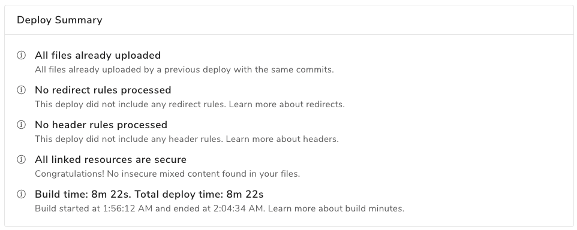

# Monitoring Your Site
Fleek offers a host of logging tools to aid in monitoring your site.

# Deploy Logs
The deploy log includes all of the standard output which comes from running your build as well as Fleek-specific information about dependency caching, Fleek configuration file processing, and more. 

# Deploy Summaries

You can find a deploy summary on the detail page of any successful deploy, right above the deploy log. It allows you to quickly identify your deploy status and refer to the details in the log based on different types of information.

The summary contains details such as the presence of Redirect rules and Header rules.

# Deleting a Site

Deleting a site is an irreversible action so proceed with caution.

To delete a site, go to the settings of the site and navigate to General > Danger Zone. A modal will then appear with a warning and instructions to delete the site.

### We are here to help

We are happy to help get your website up and running. Please feel free to reach out on our [website](https://Fleek.co), in our [Community Chat](https://join.slack.com/t/fleek-public/shared_invite/zt-bxna7y1d-PbVdut4rgHt5jM6Zjg9g9A), on [Twitter](https://twitter.com/FleekHQ), or at support@Fleek.co