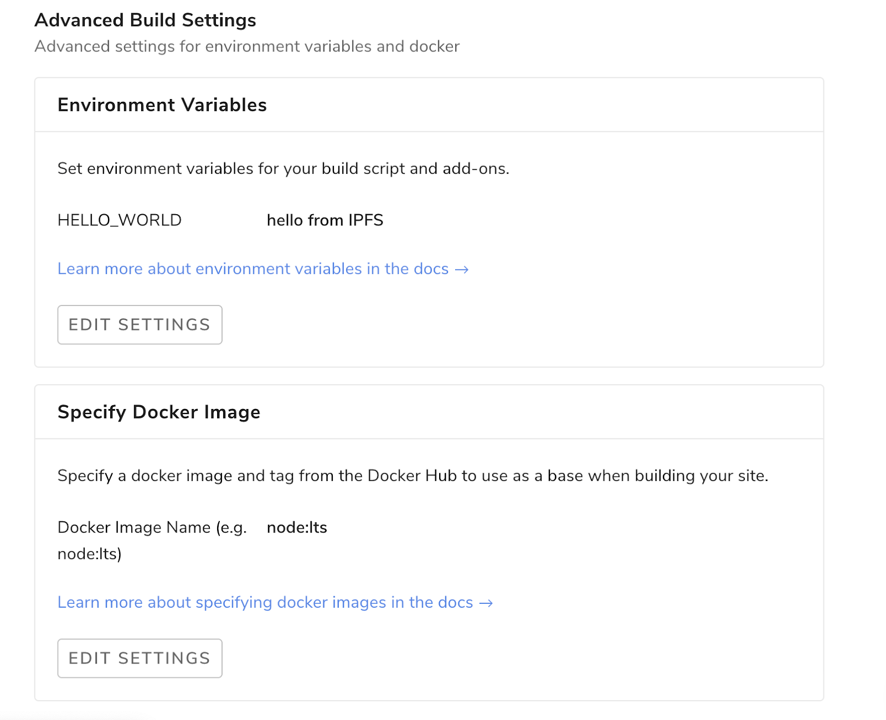

# Overview

Each new website deployment by Terminal is deployed atomically, meaning that there will never be any inconsistencies when pushing new files or making changes to existing ones.

### Deploy Summaries

You can find a deploy summary on the detail page of any successful deploy, right above the deploy log. It allows you to quickly identify your deploy status and refer to the details in the log based on different types of information.

## Create Deploys

### Deploying with Git

Simply set the base directory of your project to your github repository and define your build command. Terminal will run your build command and deploy the result whenever you push to your Git repo.

- The benefits of using continuous deployment include:
  - No deploying without committing and pushing first
  - Easy collaboration through pull/merge request-s
  - Fix a typo through your Git provider's web UI from your mobile

### Advanced Settings

When building your site, we make some assumptions about system dependencies and tools. If you are using a standard node.js environment this should be enough. There are some cases though where you might want to use custom tools not provided by default in a standard node.js distribution. For these cases, you can configure advanced settings. To do this, go to your site overview, click Settings and scroll down to the Advanced Settings section.

#### Environment Variables

Environment variables are exactly that: variables that exist on the machine that’s running your build. You can set up any amount of environment variables by clicking the “New Variable” button.

A typical use case is setting up an staging environment. You can do this by adding two sites pointing to the same repository, and then setting up the `NODE_ENV` variable differently in each site. Then, in your node.js build script you can check for this variable by doing `process.env.NODE_ENV` and for example displaying a new feature only if `process.env.NODE_ENV === staging` so that the feature is only visible in your staging environment. That way you can test your new feature before it reaches all your users.

#### Docker Image

We run builds inside a [Docker](https://www.docker.com/resources/what-container) container. If no Docker image is specified, we try to infer which one is the best suited for your project. Sometimes though, the picked docker image might be missing a dependency or two. Or maybe other times you have few dependencies and want to use a leaner Docker image to speed up the build process. In these cases, it makes sense to use a custom docker image.

*Note: You can see in our build logs which docker image was picked for your build.*

To use a custom Docker image, you just need to feel the Docker Image input with a valid Docker name + tag from an image that exists in the Docker Hub. The [Docker Hub](https://hub.docker.com/) contains thousands of publicly curated images to choose from. We recommend choosing one of the official packages and making sure the version is compatible with your build settings. Also check that the syntax of your Docker Image input is correct, it should be in the format `[name]:[tag]`.

For example, if you are building a site using the Hugo framework, you might need some Go dependencies. You can pick any of the [golang images and versions](https://hub.docker.com/_/golang). For example, `golang:1.14.0`.  Then, click “Trigger Deploy” to build your site using that image as the base.

Some popular options are:
- `jekyll/builder:pages` for Jekyll
- `golang:latest for Hugo`
- `terminalsystems/site-builder-gatsby` for Gatsby
- `node:lts` for any other node-based environment.

If you can’t find a suitable Docker image for your project, you can always build and publish your own (it’s free!). To do so, head over to the official [Docker documentation here](https://docs.docker.com/docker-hub/publish/publish/). We will also be constantly publishing popular base images at https://hub.docker.com/u/terminalsystems.

### Deploying without Git

You can also deploy your site by uploading the full code base for your website. However this will not allow for continuous deployment as you will have to upload the new code base each time you want to make a change.

### We are here to help

We are happy to help get your website up and running. Please feel free to reach out on our [website](https://terminal.co), in our [Community Chat](https://join.slack.com/t/terminal-public/shared_invite/enQtOTM1MjQ3NTExMDU3LTNkYjU1ZGJhZGUyYjgwN2I3OThjY2U5OThlMGY2MGY0OGYxMDI1OWIwMTMwYzViZGY4ZGU0NDA0YmY4ZjVhOTg), on [Twitter](https://twitter.com/terminaldotco), or at support@terminal.co 