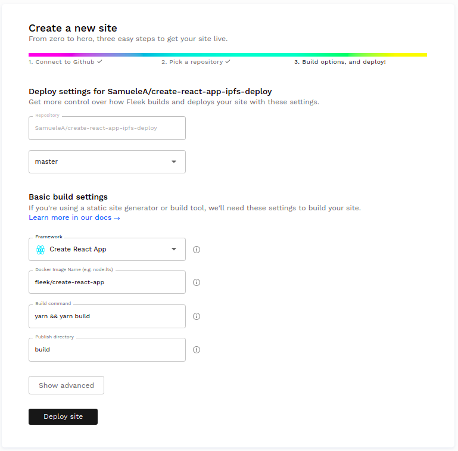
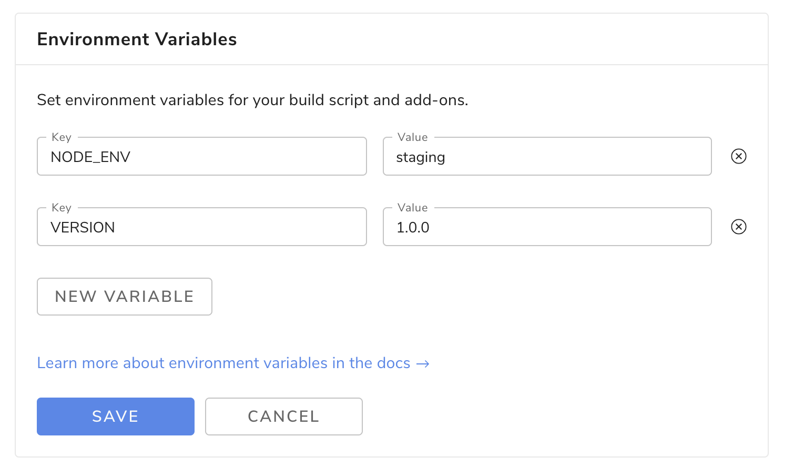
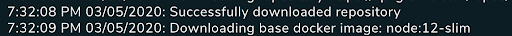

# Overview

Each new website deployment by Fleek is done atomically, meaning that there will never be any inconsistencies when pushing new files or making changes to existing ones.

# Create Deploys

### Deploying with Git

Simply set the public directory of your project to your GitHub repository and define the build command. Fleek will run the build command and deploy the result whenever you push to your Git repo. 
The benefits of using continuous deployment include:
  - No deploying without committing and pushing first
  - Easy collaboration through pull requests
  - Fix a typo through your Git provider's web UI from your mobile

# Advanced Settings

When building your site, we make some assumptions about system dependencies and tools. If you are using a standard node.js environment this should be enough. There are some cases though where you might want to use custom tools not provided by default in a standard node.js distribution. For these cases, you can configure advanced settings. To do this, go to your site overview, click Settings, and scroll down to the Advanced Settings section.

## Environment Variables

Environment variables are exactly that: variables that exist on the machine that’s running your build. You can set up any amount of environment variables by clicking the “New Variable” button.

A typical use case is setting up a staging environment. You can do this by adding two sites pointing to the same repository, and then setting up the `NODE_ENV` variable differently in each site. Then, in your node.js build script, you can check for this variable by doing `process.env.NODE_ENV` and for example displaying a new feature only if `process.env.NODE_ENV === staging` so that the feature is only visible in your staging environment. That way you can test your new feature before it reaches all your users.

## Docker Image

We run builds inside a [Docker](https://www.docker.com/resources/what-container) container. Fleek will attempt to auto-detect the framework used in the project and fill the Docker Image settings with the appropriate Docker Image. However, any Docker image from Docker Hub can be used as a Docker image.

### Fleek's Docker images

We provide Docker images for all the major frameworks such as Gatsby, Hugo, etc... These images can be found on Fleek's official Docker Hub org: <https://hub.docker.com/orgs/fleek/repositories>

In addition, to support for multiple frameworks, Fleek supports variations within each framework, such as support for multiple Node versions. The Node version is specified from the Docker tag. For example, the image `fleek/gatsby:node-10` will use version 10 of Node.js.
If no Node.js version is specified through the Docker tag, the image will use the latest version of Node.js. For example, `fleek/gatsby` is equivalent to `fleek/gatsby:latest` which is also the same as `fleek/gatsby:node-latest`, and they all use the latest Node.js version.

Also, a list of the Docker tags is available for each image on the image page on Docker Hub.
For example, here is the list of Docker tags for the `fleek/gatsby` image: <https://hub.docker.com/repository/docker/fleek/gatsby>

Finally, if you wish to see the Dockerfile from which each image is built from, the source code is made available on Github: <https://github.com/FleekHQ/site-builder-docker-images> 

#### Custom Docker Images
Sometimes, the Fleek Docker image is missing a dependency or two, or maybe you have few dependencies and want to use a leaner Docker image to speed up the build process. In these cases, it makes sense to use a custom Docker image.

*Note: You can see in our build logs which docker image was picked for your build.*

To use a custom Docker image, you just need to fill the Docker Image input with a valid Docker name + tag from an image that exists in the Docker Hub. The [Docker Hub](https://hub.docker.com/) contains thousands of publicly curated images to choose from. We recommend choosing one of the official packages and making sure the version is compatible with your build settings. Also check that the syntax of your Docker Image input is correct, it should be in the format `[name]:[tag]`.

After the docker image has been selected, “Trigger Deploy” must be clicked in order to build the site using that image as the base.

Some popular options are:
- `jekyll/builder` for Jekyll
- `node:lts` for any other node-based environment.

If you can’t find a suitable Docker image for your project, you can always build and publish your own (it’s free!). To do so, head over to the official [Docker documentation here](https://docs.docker.com/docker-hub/publish/publish/). We will also be constantly publishing popular base images at https://hub.docker.com/r/fleek/.

### We are here to help

We are happy to help get your website up and running. Please feel free to reach out on our [website](https://Fleek.co), in our [Community Chat](https://join.slack.com/t/fleek-public/shared_invite/zt-bxna7y1d-PbVdut4rgHt5jM6Zjg9g9A), on [Twitter](https://twitter.com/FleekHQ), or at support@Fleek.co