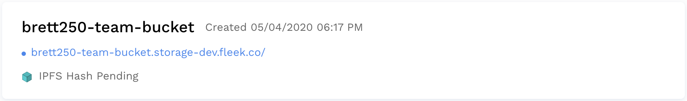
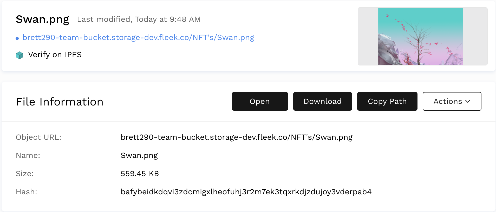

# Overview

Upload, browse, and manage all your files through the app interface. All files uploaded are published to IPFS and published to DNS, with a CDN and File Compression. You can view and reference the files through the Fleek Storage URL, and can view directly on the IPFS gateway.

The Fleek Storage app is a tool meant to host web assets. As such, all files uploaded to Fleek Storage are public.

# Upload Folders and Files

Go to the Storage page by selecting storage on the left-hand side navigation.

Click on the upload button to open the upload pop up. 

You can browse folders and files directly from your Finder, or drag and drop folders and files into the pop up.

Browse through your folders by clicking on the folder. Once you're in a folder the bucket URL will adjust to the route pointing to that folder, and this works the same for opening specific files.

### View the Bucket, Folders, or Files

You can view your bucket, folders, or files via the Fleek Storage URL or directly on the IPFS gateway

Viewing the folder or file on the Fleek Storage URL will boast the benefits of the built in CDN, file compression, and image resizing.

Bucket URL 

Folder URL

Viewing on the IPFS gateway will show the immutible IPFS file of the content within the URL.

 

### View File Details

When you open an individual file you can see detials about that particual file including the Image Preview, Object URL, Name, Size, and the IPFS Hash.

### Other Actions

You can download and delete files. If you want to delete files in bulk you can select multiple, then select delete from the Actions menu.

### We are here to help

We are happy to help get your website up and running. Please feel free to reach out on our [website](https://Fleek.co), in our [Community Chat](https://join.slack.com/t/fleek-public/shared_invite/zt-bxna7y1d-PbVdut4rgHt5jM6Zjg9g9A), on [Twitter](https://twitter.com/FleekHQ), or at support@Fleek.co