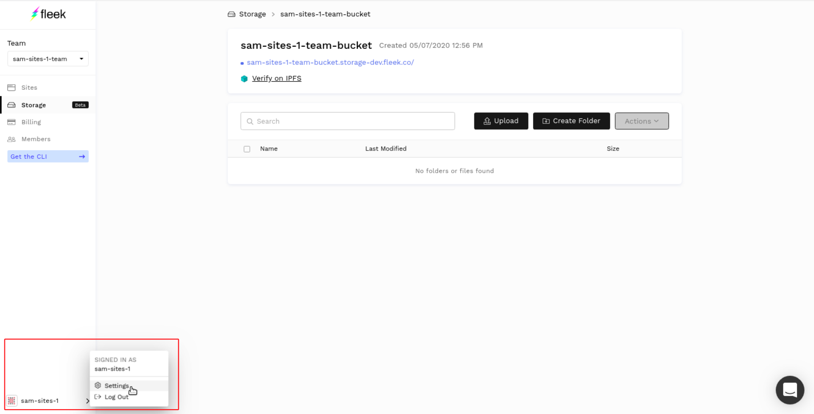

# Fleek Storage – Programmatic usage and API


## Introduction

Fleek CLI is a new release that will give you access to all of our tools directly from your terminal. Currently it allows you to log in and generate API keys that you can use with Fleek Storage. Since Fleek Storage provides a S3 interface, you can use any S3 compatible SDK to access it from anywhere by providing the generated API keys.

The Fleek Storage product is a tool meant to host web assets. As such, all files uploaded to Fleek Storage are public.

## Installation

`npm install -g @fleekhq/fleek-cli`

## Getting the API key

### From the CLI

Run the following command:

`fleek login`

It should open a browser window prompting you to log in. If you are already logged in, it will automatically close the browser window and generate the keys.

Next, run the command

`fleek  whoami`

Take note of the fields apiKey and apiSecret which will be needed in the next step.

### From the Web app

You can also generate a new api key from the Web app at [app.fleek.co](https://app.fleek.co).

The api generator is located in the user settings.



The new keys can be generated in the api section by clicking on `Create API keys`.
Make sense to copy the secret somewhere because it is only visible once.


## Accessing your bucket from code

In this example we are going to use AWS SDK for Node.JS. Note that AWS SDK is available for multiple other languages such as JavaScript, Go, C++, Python and Ruby, so this example should be adaptable to most existing applications.

First, make sure that you install the dependencies in your package.json file. You can do this by running:

`npm  init`

`npm install --save   aws-sdk `

Then, the following script outlines how to list your Fleek Storage buckets (replacing [[apiKey]] and [[apiSecret]] with the values obtained in the previous step).

    const AWS = require('aws-sdk');
   
    const s3 = new AWS.S3({
        apiVersion: '2006-03-01',
        accessKeyId: '[[apiKey]]',
        secretAccessKey: '[[apiSecret]]',
        endpoint: 'https://storageapi.fleek.co',
        region: 'us-east-1',
        s3ForcePathStyle: true
     });
 
    s3.listBuckets(function (err, data) {
        if (err) {
          console.log("Error when listing buckets", err);
        } else {
          console.log("Success when listing buckets", data);
        }
     });

Once you have your bucket name, you can fetch its contents using the following script:

    const params = {
         Bucket: "my-bucket",
         MaxKeys: 20
      };
 
    s3.listObjectsV2(params, function (err, data) {
         if (err) {
            console.log("Error when listing objects", err);
         } else {
            console.log("Success when listing objects", data);
         }
     });

You can also upload your files to the bucket with the `putObject` command.

```
  const params = {
    Bucket: 'my-team-bucket',
    Key: 'folder/my-picture',
    ContentType: 'image/png',
    Body: myPictureFile,
    ACL: 'public-read',
  };

  const request = s3.putObject(params);
  request.send();
```

### Getting the IPFS hash from http headers
Fleek will insert the ifps hash of files in the http headers.
By default, we give a v1 base32 CID. However, users can also retrieve the v0 CID which is shorter and is therefore cheaper to store on public blockchains.

```
  const request = s3.putObject(params);

  request.on('httpHeaders', (statusCode, headers) => {
    const ipfsHash = headers['x-fleek-ipfs-hash'];
    // Do stuff with ifps hash....
    const ipfsHashV0 = headers['x-fleek-ipfs-hash-v0'];
    // Do stuff with the short v0 ipfs hash... (appropriate for storing on blockchains)
  }).send();
```


Please read AWS SDK documentation for a full reference about other operations you can do on an S3 compatible API.

## Accessing from the Terminal
AWS also has tools for interacting with S3 from the terminal using AWS CLI. To do this, first install AWS CLI from https://aws.amazon.com/cli/

Then, configure the AWS CLI to point to Fleek Storage endpoint (again, replacing [[apiKey]] and [[apiSecret]] with the values obtained in the previous step).:

aws configure
AWS Access Key ID [None]: [[apiKey]]
AWS Secret Access Key [None]: [[apiSecret]]
Default region name [None]: us-east-1
Default output format [None]: ENTER

To list your buckets, run the following command:

`aws --endpoint-url https://storageapi.fleek.co s3 ls`

To list objects within a bucket, run:

`aws --endpoint-url https://storageapi.fleek.co s3 ls s3://my-bucket`


### We are here to help

We are happy to help get your website up and running. Please feel free to reach out on our [website](https://Fleek.co), in our [Community Chat](https://join.slack.com/t/fleek-public/shared_invite/zt-bxna7y1d-PbVdut4rgHt5jM6Zjg9g9A), on [Twitter](https://twitter.com/FleekHQ), or at support@Fleek.co
