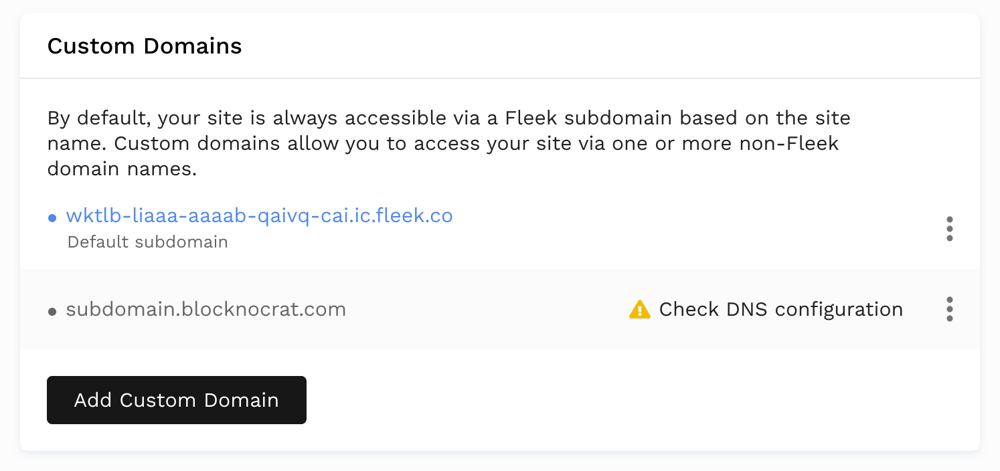
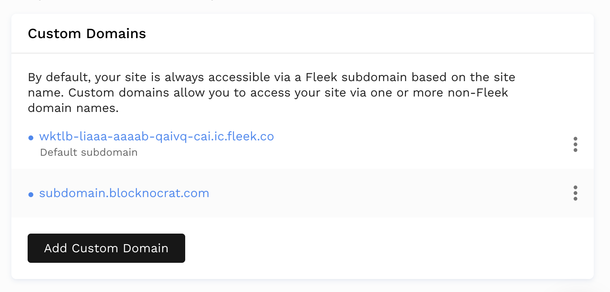

### Custom Domains
 Upon deploying a site on Dfinity, Fleek will automatically assign a domain name in the following way: [CANISTER_ID].ic.fleek.co. For example, it could look like this:

 `https://x4ytk-6yaaa-aaaab-qaiqq-cai.ic.fleek.co/`
 
This domain is created through Fleek's Dfinity Gateway, our own open source transdimensional portal to the IC. With Fleek's Dfinity Gateway, you can surface and access **any canister on the Internet Computer, not just Fleek-hosted ones**. Just replace the Canister ID on the URL with the desired canister, and you're ready.

But, aside from this auto-generated domain, on Fleek we allow users to point their Dfinity-hosted sites to a custom domain of their choice.

## Adding a Custom Domain 

1. Go to your Dfinity site's page and select `Add or register domain`
2. Enter the domain name that you would like to add
3. From here you will either have to confirm that you already own this domain or if you do not own the domain name and that it is available, you can buy it through Fleek.

### Verifying the Custom Domain
After adding the custom domain, it will appear in the site's settings under `Domain Management` > `Domains`.

The domain must be verified before it is linked to the site. To verify, click on the `Check DNS configuration` button. This will make a modal appear containing instructions to add the domain.

Follow the instructions in the modal. The steps to update the records might be slightly different depending on your domain name provider. We then must wait for the domain to be propagated before clicking on `Verify DNS configuration` on the modal.

To verify that the DNS is indeed propagated before clicking on the button, you can use a tool such as <https://dnschecker.org/>

If the verify dns was successfull, the domain name will become blue.

## ENS Domains on Dfinity
Currently, there is no native implementation of Ethereum Name Service domains on the Internet Computer. We are working together with the involved parties to make this a possibility soon, so stay tuned!