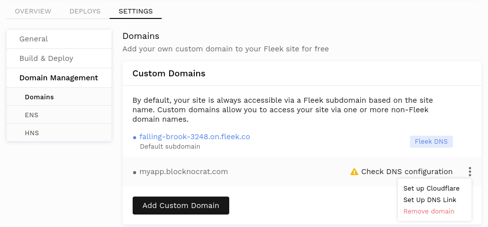
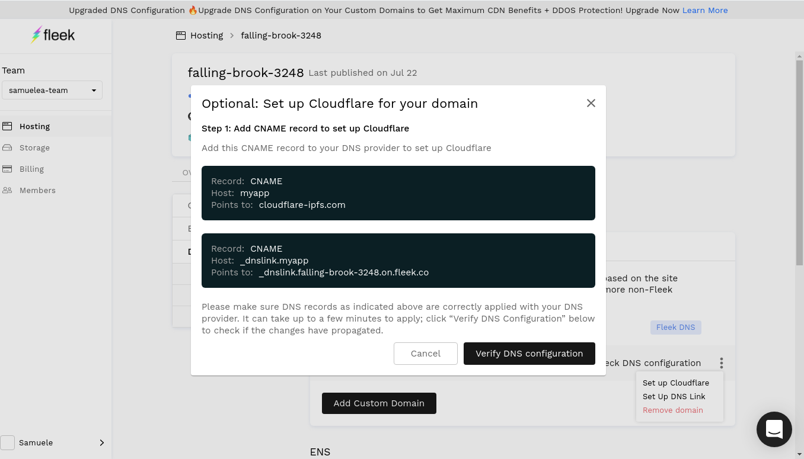
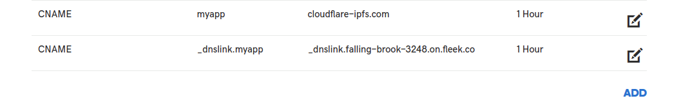
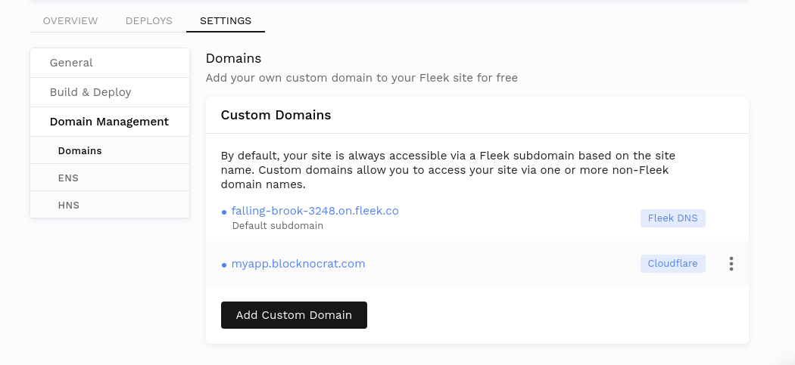

# Configuring DNSLink

DNSLink allows the mapping of a domain name to an IPFS hash. Setting up DNSLink will allow you to use a domain name to access the latest version of your site through IPFS.

For example, accessing [ipfs.io/ipns/fleek.co](https://ipfs.io/ipns/fleek.co/) will point to the most recent IPFS hash of the Fleek homepage. The utility of this feature comes from having an unchanging link pointing to the most recent IPFS hash, which changes with each new build.

The [IPFS documentation](https://docs.ipfs.io/guides/concepts/dnslink/) extrapolates further on the subject.

## Setting Up DNSLink with Fleek
The option to set up DNSLink can be accessed by navigating from the site's Settings to Domain Management > Domains > Custom Domains and clicking on the three vertical dots.

A popup will appear with directions on how to update the DNS records for DNSLink. The changes must be done through the domain registrar managing the domain, such as GoDaddy, BlueHost, HostGator, etc. The specific steps to update the records vary depending on which service you are using.

Furthermore, upon updating the records there is a delay of a few minutes before the new records are fully propagated on the internet. An online [dns checker](https://dnschecker.org/) is a very useful tool to verify that the changes are propagated fully.

Once the setup is complete, we can click on `Verify DNS configuration` to proceed.

A blue chip with the text `DNS Link` next to the domain will indicate the successful integration of DNSLink.

## Setting Up Cloudflare

This setup is a sturdy alternative to using Fleek's CDN/Cache layer. Instead, with this you would use Cloudflare for CDN/Cache/DNS features and STILL benefit from Fleek's CI/CD pipeline for deploying to IPFS. How cool is that?

### 1- Go to the settings and add a new custom domain

First, a new custom domain must be added.

After the domain is added, it will appear in the custom domains section.

### 2- Configure DNS settings

The `Set up Cloudflare` option will be available by clicking on the three dots next to the custom domain.

From there, you are given instructions pertaining the DNS settings to input in your domain provider.

After adding the DNS records, click on the `Verify DNS configuration` button.

#### 3- Done! Verify your website.

With this DNS record setup, your domain would be using the CDN & Cache features from Cloudflare. Take note that the TLS must be configured outside of Fleek. For example, Orange Cloud can be used to provide this functionality.