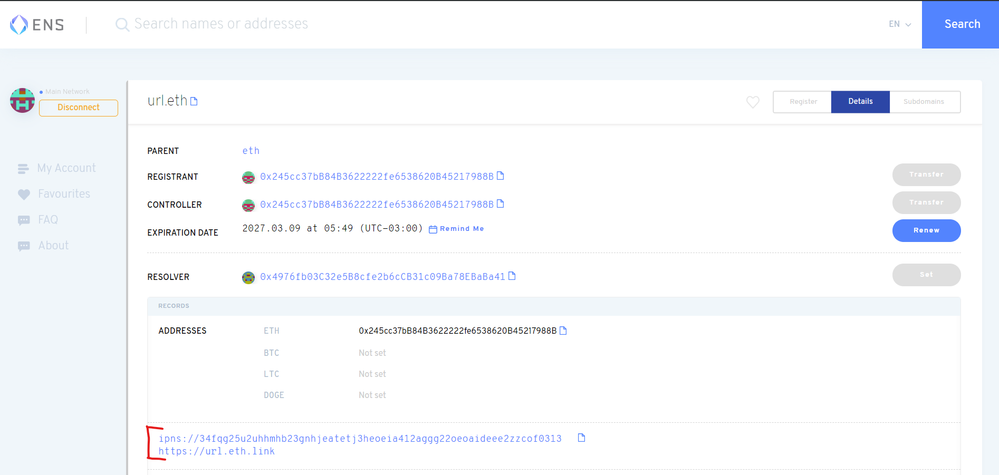
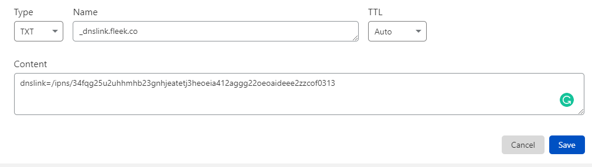

# Configuring DNSLink

DNSLink allows the mapping of a domain name to an IPFS hash. Setting up DNSLink will allow you to use a domain name to access the latest version of your site through IPFS.

For example, accessing [ipfs.io/ipns/fleek.co](https://ipfs.io/ipns/fleek.co/) will point to the most recent IPFS hash of the Fleek homepage. The utility of this feature comes from having an unchanging link pointing to the most recent IPFS hash, which changes with each new build.

The [IPFS documentation](https://docs.ipfs.io/guides/concepts/dnslink/) extrapolates further on the subject.

## Setting Up DNSLink with Fleek
The option to set up DNSLink can be accessed by navigating from the site's Settings to Domain Management > Domains > Custom Domains and clicking on the three vertical dots.

A popup will appear with directions on how to update the DNS records for DNSLink. The changes must be done through the domain registrar managing the domain, such as GoDaddy, BlueHost, HostGator, etc. The specific steps to update the records vary depending on which service you are using.

Furthermore, upon updating the records there is a delay of a few minutes before the new records are fully propagated on the internet. An online [dns checker](https://dnschecker.org/) is a very useful tool to verify that the changes are propagated fully.

Once the setup is complete, we can click on `Verify DNS configuration` to proceed.

A blue chip with the text `DNS Link` next to the domain will indicate the successful integration of DNSLink.

## Setting Up DNSLink with IPNS & Cloudflare

This setup is a sturdy alternative to using Fleek's CDN/Cache layer. Instead, with this you would use Cloudflare for CDN/Cache/DNS features, having an ENS .eth domain as a backup, pointing directly to your IPFS hash, and STILL benefit from Fleek's CI/CD pipeline for deploying to IPFS. How cool is that?

Cloudflare has a Distributed Web Gateway that supports resolving to IPFS, and you can point your IPFS hashes to your domains using it. However, **normally you would need to change that IPFS hash manually each time when you make a deployment**.

The trick? **Using IPNS with Fleek, a static hash address that represents a changing IPFS hash.** By using this, you can point Cloudflare to a static IPNS hash, that references the IPFS hash of your site's latest content on Fleek. Fleek automatically updates that IPNS address to reference the latest IPFS hash, saving you the work.

### 1- To Get Started, Add an ENS Domain to Your Site.

[Fleek uses IPNS too on Ethereum Name Service Domains](https://blog.fleek.co/posts/ens-now-on-ipns-hash-updates) for the same reason, instead of having to update the IPFS hash that ENS domain represents each time you make a deployment (which costs gas each time), we use a static IPNS address, and update the hash it references on IPFS at no cost.

**Why add an ENS domain for this?** So that we can use the same IPNS address for Cloudflare that Fleek will automatically generate for you. **In the future we will release a standalone feature so you can get an IPNS address without doing this**. But, in the meantime, this also ensures you have a backup decentralized point of access (a domain on Ethereum) to your website.

[Follow this guide to add an ENS domain](https://docs.fleek.co/domain-management/ens-domains/), and **come back for step 2 once you are ready**.

### 2- Visit https://app.ens.domains/ and verify your IPNS address

Once your ENS domain is ready and working in Fleek, visit the ENS app to verify the IPNS address that is now set as a record.

The address should look something like:

``ipns://34fqg25u2uhhmhb23gnhjeatetj3heoeia412aggg22oeoaideee2zzcof0313``

You only need to save the part that comes after "ipns://". That is your IPNS address.

``34fqg25u2uhhmhb23gnhjeatetj3heoeia412aggg22oeoaideee2zzcof0313``

### 3- Go to Cloudflare and set the proper CNAME & TXT Records

Almost there! The last step? Go to your Cloudflare account, and setup a CNAME and TXT record, [just as this guide specifies](https://developers.cloudflare.com/distributed-web/ipfs-gateway/connecting-website#connecting-to-cloudflares-gateway).

**Make sure you have a Cloudflare account and your domain is pointing to Cloudflare's nameservers** so that you can use Cloudflare to [manage your domain's DNS settings. ](https://support.cloudflare.com/hc/en-us/articles/205195708-Changing-your-domain-nameservers-to-Cloudflaredistributed-web/ipfs-gateway/connecting-website#connecting-to-cloudflares-gateway)

In a nutshell, you need to create **two DNS records**:

1. A CNAME record under your domain, pointing to ``cloudflare-ipfs.com``
2. A TXT record for ``_dnslink.your.website`` pointing to the value ``dnslink=/ipns/<your_hash_here>
``

Using the domain ``fleek.co`` and the IPNS address shown in step 2 as an example, these would look like:

#### 4- Done! Verify your website.

With this DNS record setup, your domain would use Cloudflare to provide the latest IPFS hash to your website through IPNS, using the CDN & Cache features from Cloudflare.