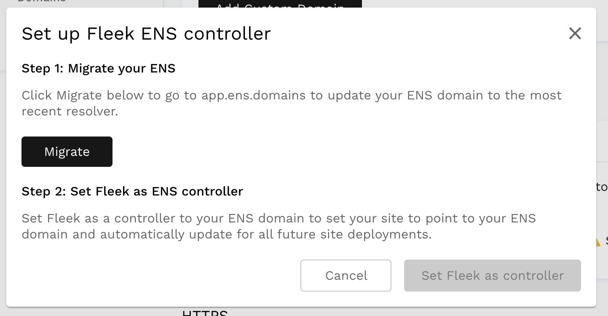

# ENS Domains

You can easily point an [Ethereum Name Service](https://ens.domains/) (ENS) domain to your **IPFS site** and have the content automatically update for future deployments. The benefit of ENS domains is that they are decentralized and trustless, running on the Ethereum blockchain network through smart contracts. 

It's important to note that, for a user to **resolve/visit an ENS domain** they will need to have a compatible provider/browser installed that is able to resolve them. **Using the MetaMask browser extension is one option**, as it resolves .eth domains.

!!! info

    Ethereum Name Service (ENS) domains are only compatible with IPFS sites at the moment. We are exploring ways to bring ENS to Internet Computer hosted sites in the future!

### Deploying

Once your app is deployed on Fleek, go to the settings page in the left-hand bar menu and click `Domain Management`. Scrolling a bit would land you on the section that says `ENS`

### Adding ENS Domain

Click Add ENS to add your ENS domain. Input your domain to verify it and add it. If the domain does not belong to anyone you will be redirected to the [ENS Dashboard](https://app.ens.domains) to buy it.

!!! note
    Your domain will appear in the settings page and can also be deleted from there.

### Set Fleek as the Controller through the UI

Fleek needs to be a controller of your ENS domain so we can automatically update your domain content hash when a site deployment succeeds. Click the `Set Fleek as Controller` button to set this up.

If the domain is using the old ENS resolver, you will be prompted to migrate to the latest resolver. By clicking on the `Migrate` button, you will be redirected to the [ENS Dashboard](https://app.ens.domains) to complete the migration.

Finally, clicking on the `Set Fleek as controller` button will trigger a modal to connect an Ethereum web3 provider, such as [Metamask](https://metamask.io/). If using Metamask, a popup will appear asking to connect. After, another popup will appear to accept the Ethereum transaction to set Fleek as controller.

On the Settings section, the domain will show that the Ethereum transaction is pending confirmation. Upon confirmation, the ENS domain will have been successfully added to Fleek. 

### Set Fleek as Controller manually
The Fleek controller can also be set manually through the official [ENS frontend](https://app.ens.domains), or by interacting directly with the smart contracts.

The value for the controller address must be `0x31166ec8996643A35c2cf8cEbED980e26cd89D06`, which corresponds to the Ethereum address of Fleek's controller.

After manually setting the controller, adding the ENS through the app will work normally, except that Fleek will detect that the controller is already set and will complete the setup without executing an Ethereum transaction.