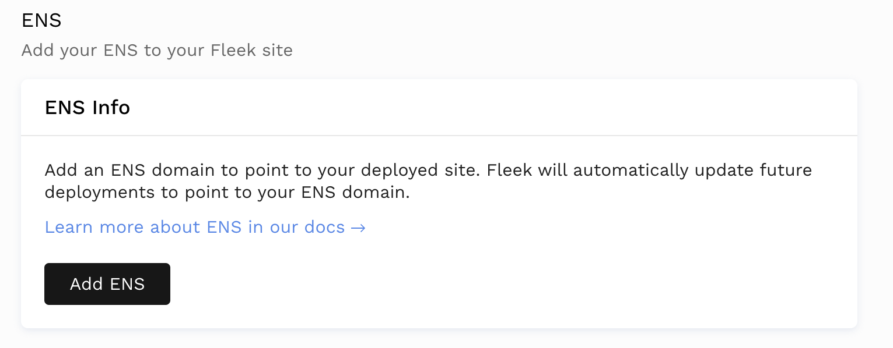
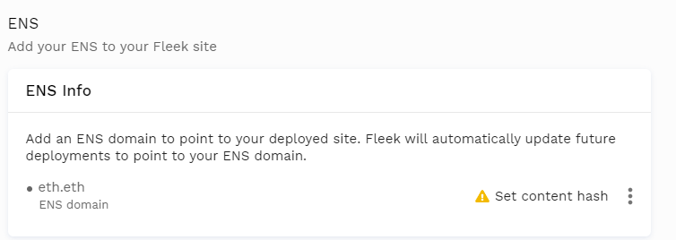
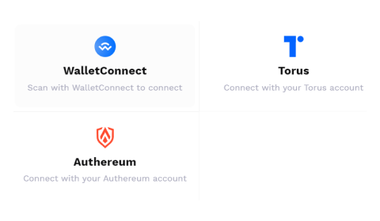
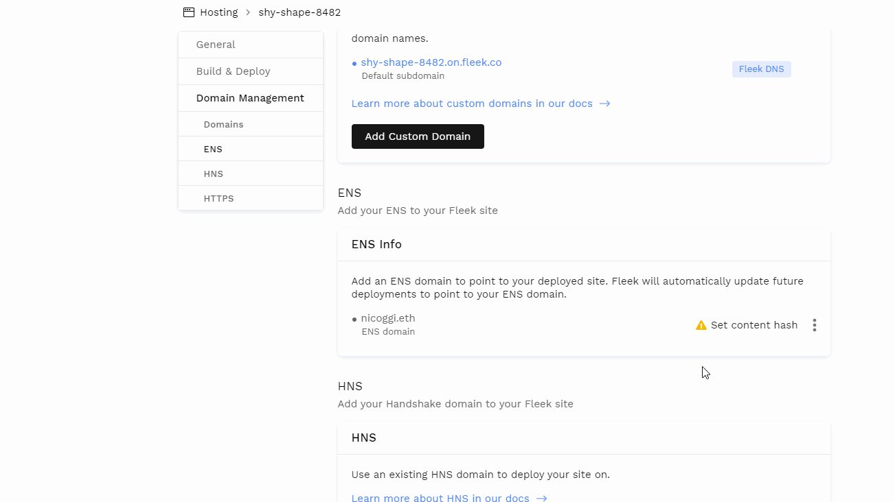
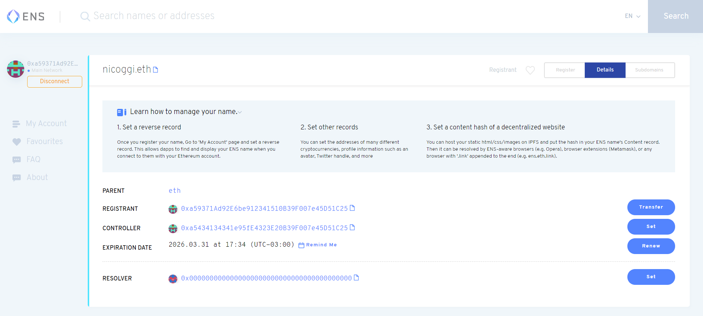
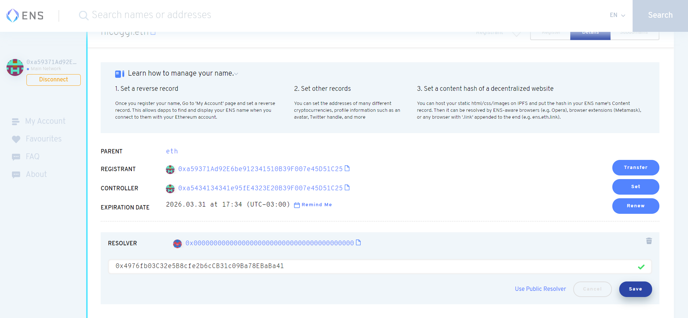
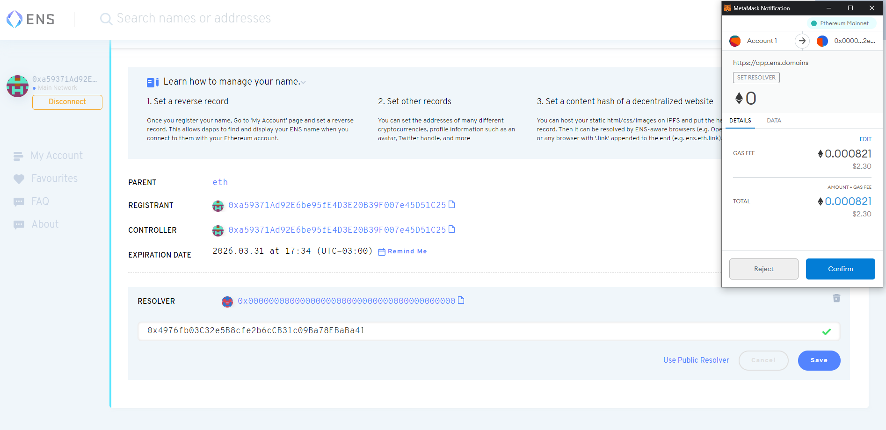
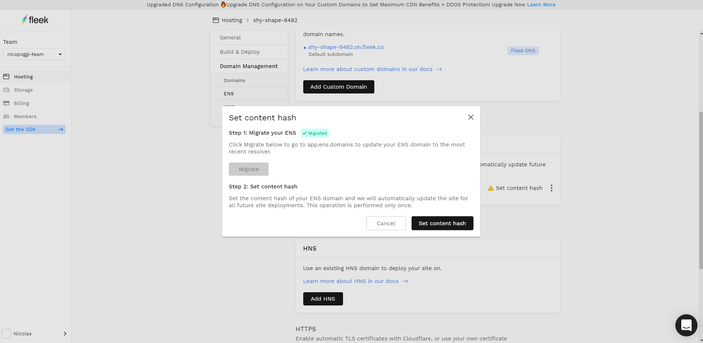

# ENS Domains

You can easily point an [Ethereum Name Service](https://ens.domains/) (ENS) domain to your **IPFS site** and have the content automatically update for future deployments. The benefit of ENS domains is that they are decentralized and trustless, running on the Ethereum blockchain network through smart contracts. 

It's important to note that, for a user to **resolve/visit an ENS domain** they will need to have a compatible provider/browser installed that is able to resolve them. **Using the MetaMask browser extension is one option**, as it resolves .eth domains.

**Need help with an ENS domain?** Visit the [ENS troubleshooting section](https://docs.fleek.co/domain-management/troubleshooting/#troubleshooting-ens-domains). 

!!! info

    Ethereum Name Service (ENS) domains are only compatible with IPFS sites at the moment. We are exploring ways to bring ENS to Internet Computer hosted sites in the future!

### Deploying

Once your app is deployed on Fleek, go to the settings page in the left-hand bar menu and click `Domain Management`. Scrolling a bit would land you on the section that says `ENS`

### Adding ENS Domain

Click Add ENS to add your ENS domain. Input your domain to verify it and add it. If the domain does not belong to anyone you will be redirected to the [ENS Dashboard](https://app.ens.domains) to buy it.

!!! note
    Your domain will appear in the settings page and can also be deleted from there.

### Set the Content Hash

Once you add your first ENS domain, you will need to SET THE CONTENT hash. This means you will set the IPNS address that references your site on Fleek, and that Fleek will update periodically upon each deployment to keep your sites' content up to date. **Click set content hash to begin the process**

You need to trigger one transaction through an Ethereum Web3 provider, such as [Metamask](https://metamask.io/). If using Metamask, a popup will appear asking to connect.

!!! info

    Important: If when you click 'set content hash', you see a prompt to "Migrate your ENS domain" there is an extra step you need to do before you continue. See the 'Migrate Your ENS Resolver' section below.

This transaction sets the initial content hash / IPNS address that Fleek will automatically update on your ENS domain upon each deployment to refresh the content to the latest commit.

**Previously, when Fleek didn't use IPNS**, Fleek was set as the controller of the ENS domain to modify the IPFS content hash manually each time. Now, using IPNS, that is not necessary and only one transaction is needed.

**Once you approve the transaction**, on the Settings section, the domain will show that the Ethereum transaction is pending confirmation. **Upon confirmation** the ENS domain will have been successfully added to Fleek. Hooray!

### Migrate Your ENS Resolver

If when you begin the "Set the Content Hash Flow", you find yourself viewing a **different screen, that tells you you need to "Migrate Your ENS"**, it means you need to migrate your ENS domain's resolver to be able to use that domain with Fleek.

!!! info

    Why does this happen? The resolver is the "service" your ENS domain name uses so that when someone visits the domain, it translates the request to the addresses/URLs/content that your ENS name represents. Resolvers are Smart Contracts on Ethereum, and there are many of them to choose from, thereforee they are set as a record in your ENS domain nam where the address of said contract is specified. Usually, when you create a new ENS domain name, a default, public resolver is set. 

**If your ENS domain name is configured using a legacy, or outdated resolver** you won't be able to access your site since resolving won't work properly.

**To migrate your domain: Click the Migrate button on the window seen above** and the Ethereum Name Service Application will open, on your domain's details page.

**In the RESOLVER section, click the SET button** to open up the window that will help you reconfigure your ENS domain resolver. **Click the 'USE PUBLIC RESOLVER' option to have ENS auto-fill with a public, up-to-date, resolver**. Alternatively, you can use a custom one if you now the proper address.

**Hit SAVE** and you will prompt a transaction on the ENS application that you will need to confirm with any compatible wallet, like MetaMask, paying the associated gas fee for the transaction that sets the record.

**When the transaction is confirmed**, go back to the Fleek application and your site's domain management page. You will see that if you reopen the 'SET CONTENT HASH' window, the migration will be registered and you can continue with the flow normally following the steps above.

### Review Your ENS Site with eth.link, MetaMask, or Other Options.

If you’re using an ENS-compatible browser, like [Brave](https://brave.com/), or if you have the [MetaMask](https://metamask.io/) extension installed like in the GIF above, you can just type your address in the search bar “address.eth/” (don’t forget the “/”) and it should be automatically resolved: fleekhq.eth/

**Using eth.link**
If you have none of those, you can always append the “.link” suffix after your domain to visit your IPFS+ENS website on any browser, thanks to a service made available by ENS and Cloudflare that makes all the .eth domains accessible via traditional DNS addresses. Anyone can visit and resolve your site. [Visit the ENS app with .link!](http://ens.eth.link/) 

**All of these are third-party resolving options** you, or anyone, can use to visit your site using .eth ENS domains. Be aware that these are non-Fleek platforms. If your ENS record is configured properly, and you experience an issue on any of these gateways, contact that specific provider.