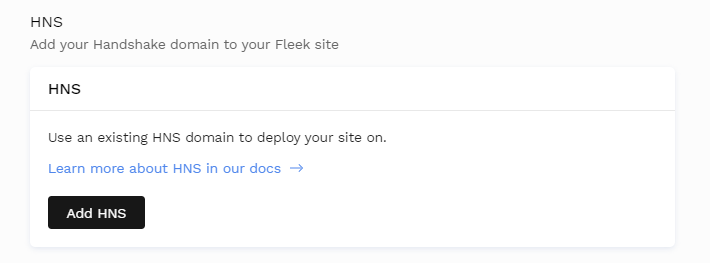
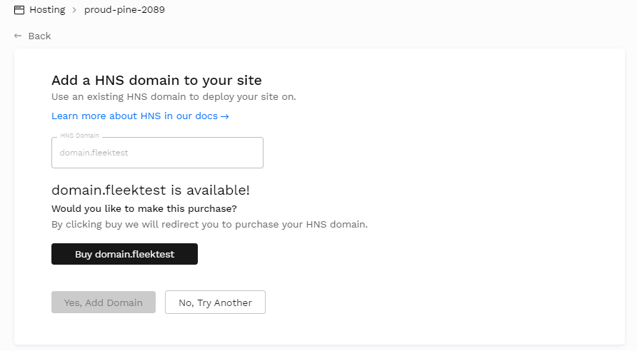

# HNS Domains

With Fleek you can also add [Handshake](https://handshake.org/) (HNS) domain names from the Handshake protocol/blockchain. This alternative to DNS/ENS is a decentralized naming protocol in which you don't buy domains themselves, but Top Level Domains (TLDs) like .domain or .fleek.

You can then create domains inside those TLDs and use them just like DNS on your Fleek-hosted site, via the HNS flow. To buy a new domain name, go to [Namebase](https://www.namebase.io/).

Handshake domains are **not resolved by most browsers natively**, see the guides below that sharesall the options and compatible browsers you and your users can use to resolve and visit sites using HNS domains.

!!! info

    Handshake (HNS) domains are compatible with both IPFS & Internet Computer sites.

### Adding HNS Domains

Visit the `Domain Management` after deploying a site on Fleek, and search for the `HNS` section. HNS works exactly like DNS in terms of the workflow you must complete to link it to your Fleek site:

1. You add or buy your HNS domain
2. You verify it via a custom record
3. You redeploy your site

If you enter a domain that already has been purchased, you will be asked to confirm if it is yours; if it is not purchased yet, you will have the option to be redirected to Namebase to do so.

### Configuring Records

Finally, once you add or purchase a new HNS domain, you must do just like with DNS domain names: you need to configure a custom record so that it is properly linked and verified.

You can use Namebase to do so, via their UI, or your own custom Nameserver to add the record that points to your app to your domain. That is all! Once you are done, you will have an HNS domain pointing to your Fleek-hosted project.

### Accessing / Resolving HNS Websites

Handshake domains live on the Handshake blockchain, much like ENS names live on Ethereum, and are not yet fully supported/resolved but most browsers.

While that situation changes, you still have several options for resolving your HNS website. You can use [**hns.to**](https://hns.to/) to quickly verify that your new  site is up. hns.to is a Handshake resolver, you can use its search engine to find your site, or append at the end of your HNS domain name `my.site.hns.to` to view it over HTTP.

Another option is to use an **HNS compatible browser or extension**, [like PUMA](https://www.pumabrowser.com/), or the [LinkFrame extension](https://chrome.google.com/webstore/detail/linkframe/klcheodcjdbkbiljlcfiphagmkhbifmm?hl=en-US&authuser=0) for Chrome. 

If you want, you can also change your **devices' DNS** to point to HNS resolving ones, like [HDNS](https://www.hdns.io/); or go all the way and install **Handshake's node,** [**hds **](https://hsd-dev.org/)to resolve their domains trustlessly.

For more options, visit [Namebase's guide](https://learn.namebase.io/starting-from-zero/how-to-access-handshake-sites#level-3-dns) detailing all available options by technical level.