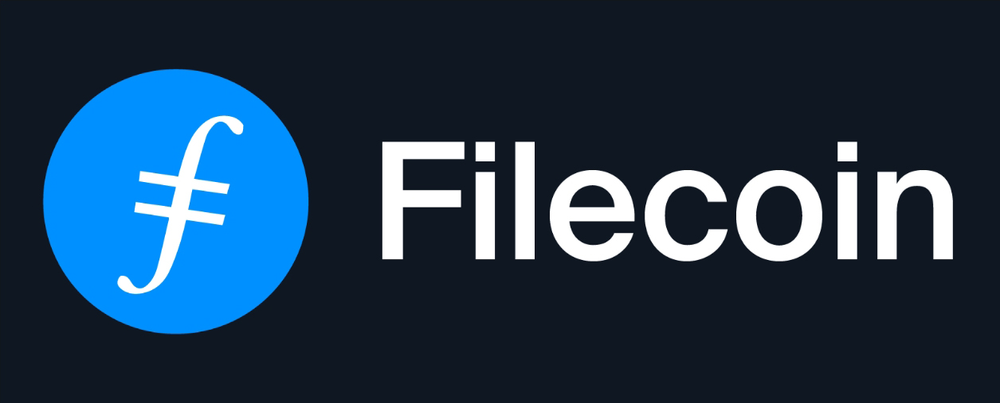

Fleek archives all sites and storage hosted on the platform automatically to [Filecoin](https://filecoin.io/), the decentralized storage network. This is done as a **backup** layer, in spite of Fleek's traditional backup infrastructure on IPFS/AWS, to ensure users have the guarantee that their sites and storage don't rely solely on the Fleek platform, but live decentralized as well.

To learn more about why we are doing this, and what is the role of Filecoin in our road to decentralization, read the following [article](https://blog.fleek.co/posts/filecoin-archiving-backup-fleek-sites-and-storage)

## Overview | Filecoin Archiving in Fleek
In its initial version, Filecoin acts as a secondary backup layer parallel to our main IPFS storage infrastructure.

While IPFS is our performant day-to-day storage layer, Filecoin acts as a **cold storage** for our user's information and sites.

Filecoin Archiving in Fleek:

- Is Enabled for all users and accounts, no matter their plan.
- Has no cost attached to it whatsoever, or extra fees.

## The Archiving Process
### User Uploads a File / Hosts a Site
When a user uploads a file to Fleek storage or hosts a site/app on IPFS with Fleek, this file is automatically batched together with other files until a minimum of 5GB (minimum snapshot size Filecoin currently provides). Due to this, there can be a 1 or 2 day delay between upload/hosting and the deal's registration.

### The Deal Begins
Once the 5GB snapshot is reached, the batched data is sent for deal making on the Filecoin network. **It's important to note** that existing data is processed in the background and in parallel with new uploads, so each can have a different deal timings.

The deal making process is currently handled by Fleek, and when the deal goes into the active state, Fleek presents the user with the **Deal ID** and **Proposal CID**, which they can use to verify via any external website like [Filfox](https://filfox.info/en/deal) that the Filecoin archiving of their files has been completed.

### The Miner Receives the Data
Once the data is successfully sent to the Filecoin miner, they begin the "sector sealing" process, in which they generate a proof-of-replication and encode the information to allow for the continuous proof of storage.

The proof of storage, or Proof of SpaceTime, is a constant check and validation the miner provides to both the user and the network ensuring the permanence and longevity of the archive, avoiding being penalized and being rewarded for their storage (mining).

## Our Setup and Processing
Fleek interacts with the Filecoin network, sends data for archiving, and else via our own Lotus node implementation, which we use to transfer dat on-chain to the storage miner.

## Viewing the Deal ID and Proposal CID

If you access your Fleek account, and view the details of an IPFS site or file stored through Fleek, you will now see two new fields. The Deal ID, and the proposal CID, which correspond to the batch and deal in which Fleek sent your data to be backuped to the Filecoin network.