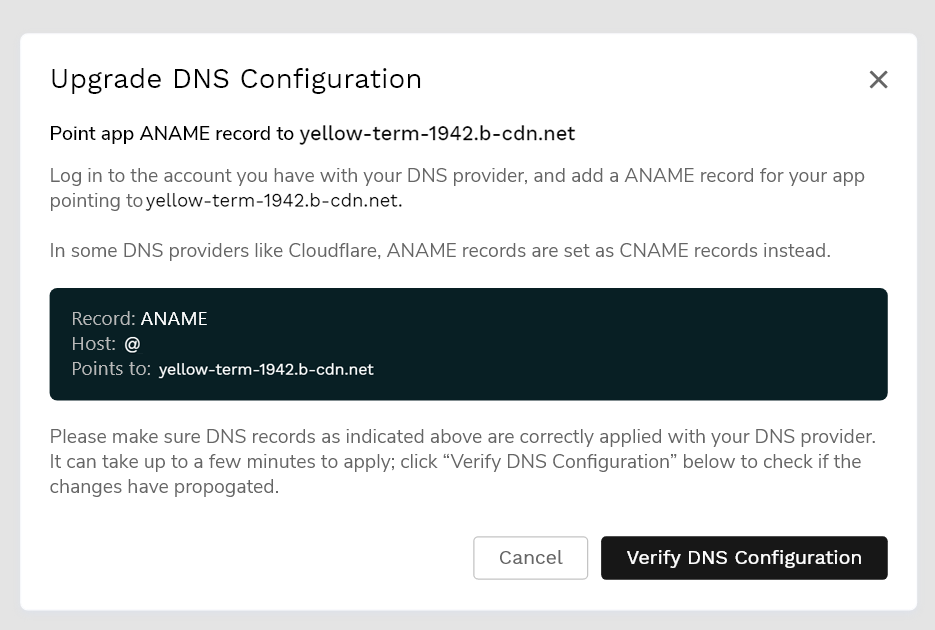
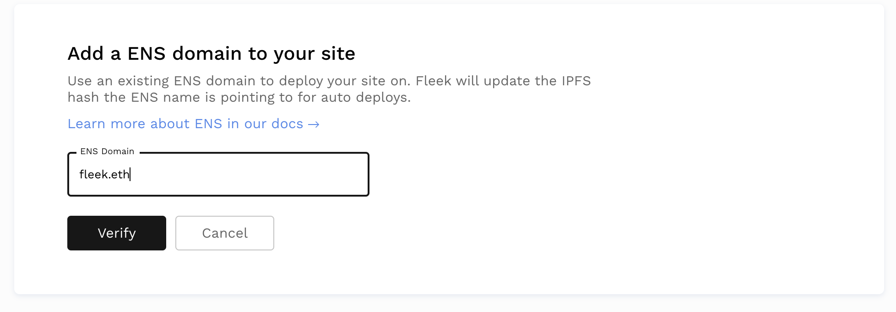

### Custom Domains
 Upon site creation, Fleek will automatically assign a domain name in the following way: [RANDOM_NAME].on.fleek.co.
 Of course, we allow users to point the site to a custom domain of their choice.

!!! info

    As of May 2021, we've upgraded our DNS custom domain configuration to unlock extra CDN features, automatic and scalable DDOS protection, and other perks like perma-caching for all sites/apps using DNS names on Fleek. This new setup requires that your DNS service/provider supports ANAME.

    If you set up your DNS domain before May 2021, you need to migrate to this new configuration before May 31st, where all sites using the legacy proxy/DNS will stop working.
    
    See the section "Upgrading to New DNS Configuration".

#### Adding a Custom Domain 

1. Go to your site's page and select `Add or register domain`
2. Enter the domain you would like to add
3. From here you will either have to confirm that you already own this domain or if you do not own the domain name and that it is available, you can buy it through Fleek.

#### Verifying the Custom Domain
After adding the custom domain, it will appear in the site's settings under `Domain Management` > `Domains`.

The domain must be verified before it is linked to the site. To verify, click on the `Check DNS configuration` button. This will make a modal appear containing instructions to add the domain.
Follow the instructions in the modal. The steps to update the records might be slightly different depending on your domain name provider.
We then must wait for the domain to be propagated before clicking on `Verify DNS configuration` on the modal.

To verify that the DNS is indeed propagated before clicking on the button, you can use a tool such as <https://dnschecker.org/>

If the verify dns was successfull, the domain name will become blue.

### Upgrading to New DNS Configuration (DDOS Protected)
If you setup your Fleek site/app with a DNS domain before May 2021, you are using Fleek's old infrastructure with HAProxy.

Since then, we have upgraded and migrated to a new infrastructure that uses BunnyCDN to provide users that utilize DNS domains with CDN & security perks:

- Automatic DDOS/HTTP attack protection
- Perma-caching
- Faster auto-routing

**Important requirement**: This new infrastructure requires you that your DNS service/provider where you acquired your domain supports **ANAME records**. Make sure your provider does so **before trying to upgrade**, or move to a new provider if needed.

To migrate your site log into your Fleek account, and do this for every site that uses a custom DNS domain. Once you're logged in, visit the hosting tab, and click on a site on the list to get started.

Once inside a site's detail view, visit the SETTINGS tab and there, look for the Domain Management tab on the vertical sub-menu.

There, you will see the Custom Domains section, showing the Custom DNS Domain name you set up and connected to your Fleek site/app. Click on "Upgrade DNS Configuration" to re-configure your site.

In a nutshell, you will need to update the records on your DNS domain. This is because your custom domains need to point to Fleek's new upgraded infrastructure. 

**Root domain names (space.storage) will ask for an ANAME record, whereas any subdomain or www. domain (like www.space.storage) will use CNAME**.

**In some providers like Cloudflare**, ANAME records are inputted as CNAME, so verify with your provider's documentation first. You might see ANAME records called as ALIAS as well.

Once you have updated your records on your DNS provider, come back to Fleek to Verify the DNS Configuration once you do so. 

That is all! Your site will be updated to our new faster, and safer, DNS infrastructure.

### ENS Domains

You can now easily point an ENS domain to your IPFS site and have the content automatically update for future deployments. Here is how to set up an ENS domain for your site:

#### Deploying

Once your app is deployed on Fleek, go to the settings page in the left-hand bar menu and click `Domain Management`. Scrolling a bit would land you on the section that says `ENS`

#### Adding ENS Domain

Click Add ENS to add your ENS domain. Input your domain to verify it and add it. If the domain does not belong to anyone you will be redirected to the [ENS Dashboard](https://app.ens.domains) to buy it.

!!! note
    Your domain will appear in the settings page and can also be deleted from there.

#### Set Fleek as the Controller through the UI

Fleek needs to be a controller of your ENS domain so we can automatically update your domain content hash when a site deployment succeeds. Click the `Set Fleek as Controller` button to set this up.

If the domain is using the old ENS resolver, you will be prompted to migrate to the latest resolver. By clicking on the `Migrate` button, you will be redirected to the [ENS Dashboard](https://app.ens.domains) to complete the migration.

Finally, clicking on the `Set Fleek as controller` button will trigger a modal to connect an Ethereum web3 provider, such as [Metamask](https://metamask.io/). If using Metamask, a popup will appear asking to connect. After, another popup will appear to accept the Ethereum transaction to set Fleek as controller.

On the Settings section, the domain will show that the Ethereum transaction is pending confirmation. Upon confirmation, the ENS domain will have been successfully added to Fleek. 

#### Set Fleek as Controller manually
The Fleek controller can also be set manually through the official [ENS frontend](https://app.ens.domains), or by interacting directly with the smart contracts.

The value for the controller address must be `0x31166ec8996643A35c2cf8cEbED980e26cd89D06`, which corresponds to the Ethereum address of Fleek's controller.

After manually setting the controller, adding the ENS through the app will work normally, except that Fleek will detect that the controller is already set and will complete the setup without executing an Ethereum transaction.

#### Troubleshooting ENS domains
* You can quickly test that the ENS domain is correctly synced with the IPFS hash of the current build by appending `.link` after the domain. EG: <https://fleekhq.eth.link>

* You must ensure that your browser is able to resolve ENS domains. You can test this functionality with Fleek's homepage: [fleek.eth/](https://fleek.eth/).

* It's possible the link doesn't immediately work. Most browsers, if not all of them, will redirect the user to an IPFS gateway and it is possible that the content for that IPFS hash has not yet propagated to the gateway. Wait a few minutes if that is the case.

### HNS Domains

With Fleek you can also add [Handshake](https://handshake.org/) (HNS) domain names from the Handshake protocol/blockchain. This alternative to DNS/ENS is a decentralized naming protocol in which you don't buy domains themselves, but Top Level Domains (TLDs) like .domain or .fleek.

You can then create domains inside those TLDs and use them just like DNS on your Fleek-hosted site, via the HNS flow. To buy a new domain name, go to [Namebase](https://www.namebase.io/).

#### Adding HNS Domains

Visit the `Domain Management` after deploying a site on Fleek, and search for the `HNS` section. HNS works exactly like DNS in terms of the workflow you must complete to link it to your Fleek site:

1. You add or buy your HNS domain
2. You verify it via a custom record
3. You redeploy your site

If you enter a domain that already has been purchased, you will be asked to confirm if it is yours; if it is not purchased yet, you will have the option to be redirected to Namebase to do so.

#### Configuring Records

Finally, once you add or purchase a new HNS domain, you must do just like with DNS domain names: you need to configure a custom record so that it is properly linked and verified.

You can use Namebase to do so, via their UI, or your own custom Nameserver to add the record that points to your app to your domain. That is all! Once you are done, you will have an HNS domain pointing to your Fleek-hosted project.

### Accessing / Resolving HNS Websites

Handshake domains live on the Handshake blockchain, much like ENS names live on Ethereum, and are not yet fully supported/resolved but most browsers.

While that situation changes, you still have several options for resolving your HNS website. You can use [**hns.to**](https://hns.to/) to quickly verify that your new  site is up. hns.to is a Handshake resolver, you can use its search engine to find your site, or append at the end of your HNS domain name `my.site.hns.to` to view it over HTTP.

Another option is to use an **HNS compatible browser or extension**, [like PUMA](https://www.pumabrowser.com/), or the [LinkFrame extension](https://chrome.google.com/webstore/detail/linkframe/klcheodcjdbkbiljlcfiphagmkhbifmm?hl=en-US&authuser=0) for Chrome. 

If you want, you can also change your **devices' DNS** to point to HNS resolving ones, like [HDNS](https://www.hdns.io/); or go all the way and install **Handshake's node,** [**hds **](https://hsd-dev.org/)to resolve their domains trustlessly.

For more options, visit [Namebase's guide](https://learn.namebase.io/starting-from-zero/how-to-access-handshake-sites#level-3-dns) detailing all available options by technical level.

### DNSLink

DNSLink allows the mapping of a domain name to an IPFS hash. Setting up DNSLink will allow you to use a domain name to access the latest version of your site through IPFS.

For example, accessing [ipfs.io/ipns/fleek.co](https://ipfs.io/ipns/fleek.co/) will point to the most recent IPFS hash of the Fleek homepage. The utility of this feature comes from having an unchanging link pointing to the most recent IPFS hash, which changes with each new build.

The [IPFS documentation](https://docs.ipfs.io/guides/concepts/dnslink/) extrapolates further on the subject.

#### Setting Up DNSLink
The option to set up DNSLink can be accessed by navigating from the site's Settings to Domain Management > Domains > Custom Domains and clicking on the three vertical dots.

A popup will appear with directions on how to update the DNS records for DNSLink. The changes must be done through the domain registrar managing the domain, such as GoDaddy, BlueHost, HostGator, etc. The specific steps to update the records vary depending on which service you are using.

Furthermore, upon updating the records there is a delay of a few minutes before the new records are fully propagated on the internet. An online [dns checker](https://dnschecker.org/) is a very useful tool to verify that the changes are propagated fully.

Once the setup is complete, we can click on `Verify DNS configuration` to proceed.

A blue chip with the text `DNS Link` next to the domain will indicate the successful integration of DNSLink.

