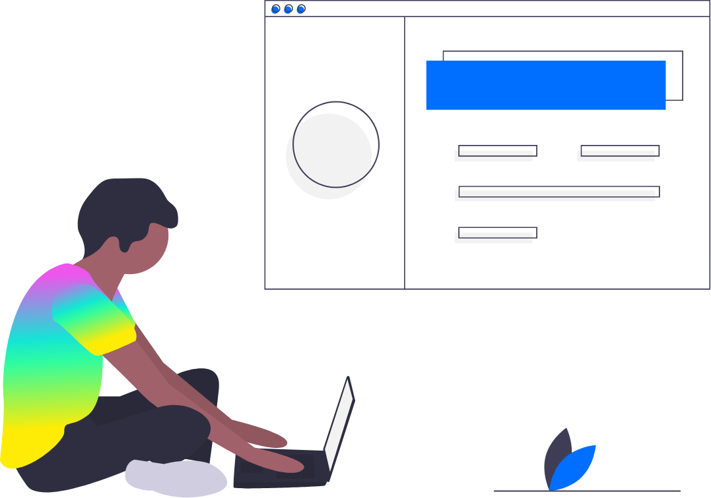

# Overview

From local development to global deployment, Fleek is everything you need to host fast, modern sites & apps on IPFS. All in one seamless workflow. Deploy your site in a few quick clicks onto IPFS with a built in CDN for blazing fast performance. 

!!! info

    When you deploy on Fleek your site will have an IPFS hash and future automatic deployments will also update the IPFS hash of your site. Your site comes with a CDN, free SSL certificate, and a Fleek preview URL. You can add Custom Domains, ENS Domains, Configure Deploy Previews, and more.

### Getting Started

Getting Started with Fleek by deploying your first website. The quickest way to begin is by connecting your website's GitHub repository to deploy directly from there and allow for continuous deployment.
If you so choose, you can also deploy by uploading the full code base for you website.

  <a href="../site-deployment/#creating-a-deployment" class="prev-box">
    <h5>Deploy</h5>
    
Deploy in Few Quick Clicks

  </a>
  <a href="../site-deployment/#configuring-the-deployment" class="prev-box">
    <h5>Build Configurations</h5>
    
Get Build Settings for Popular Frameworks

  </a>
  <a href="../domain-management/" class="prev-box">
    <h5>Domain management</h5>
      
Add Root/Sub Domains To Your Site

  </a>
    <a href="../domain-management/#adding-ens-domain" class="prev-box">

    <h5>ENS Domains</h5>
    
Add ENS Domains To Your Site

  </a>
    <a href="../../tutorials/hosting/" class="prev-box">
    <h5>Tutorials</h5>
    
Guides and Tutorials on Popular Frameworks

  </a>

