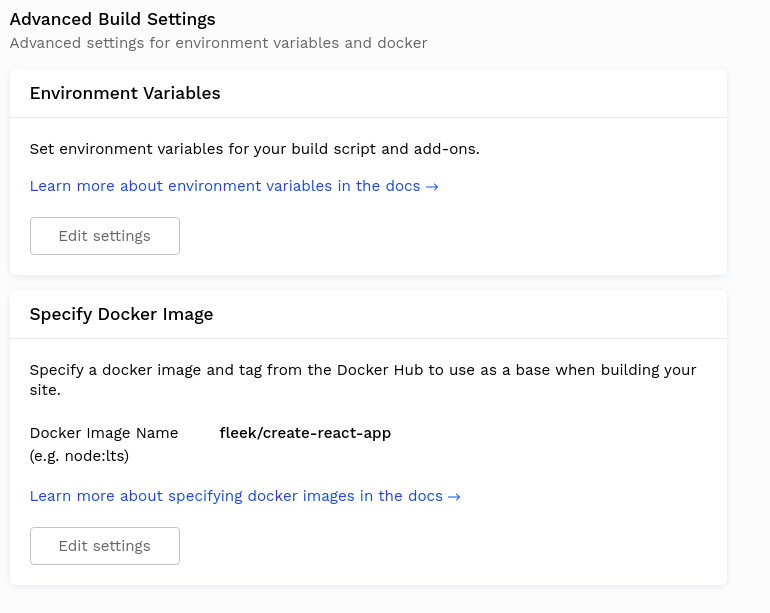

# Site Deployment

Each new website deployment by Fleek is done atomically, meaning that there will never be any inconsistencies when pushing new files or making changes to existing ones.

## Creating a deployment

### With Git


Simply set the public directory of your project to your GitHub repository and define the build command. Fleek will run the build command and deploy the result whenever you push to your Git repo. The benefits of using continuous deployment include:

- No deploying without committing and pushing first
- Easy collaboration through pull requests
- Fix a typo through your Git provider's web UI from your mobile

## Configuring the deployment
### Build parameters
Fleek will attempt to autodetect the site's framework and apply the correct build parameters. In some cases, however, you might need to input the parameters manually, either at the initial site deployment stage, or in the site settings after the site has already been deployed.

Below are the build parameters which you can modify.

- `Docker image`: The name of the docker image on [docker hub](https://hub.docker.com/) in which your site will be built, defaults to `node:slim`. Fleek provides [images for many popular frameworks](https://hub.docker.com/orgs/fleek/repositories), but you can use any that suits your project.
- `Build command`: The commands to execute to build the site. EG: `npm install &&& npm run build`  
- `Publish directory`: The name of the directory containing the `index.html` file of your site after it has been built
- `Environment variables`: The values of your environment variables. It is here for example that you might set your environment as `production`

### Common frameworks

You will also have to define the correct publish directory, here's list of default configurations for popular frameworks:

| Framework          | Docker Image           | Build Command                       | Public Directory | Additional documentation |
|--------------------|------------------------|-------------------------------------|------------------|------------------|
| Create React App   | fleek/create-react-app | `yarn && yarn build`                | build            | <a href="https://blog.fleek.co/posts/fleek-create-react-app" target="_blank">Tutorial blog post</a> |
| Gatsby             | fleek/gatsby           | `yarn && gatsby build`              | public           | <a href="https://blog.fleek.co/posts/Gatsby-Fleek" target="_blank">Tutorial blog post</a> |
| Hugo               | fleek/hugo             | `yarn && hugo`                      | public           | <a href="https://blog.fleek.co/posts/go-with-hugo-and-fleek" target="_blank">Tutorial blog post</a> |
| Jekyll             | fleek/jekyll           | `jekyll build`                      | _site            | <a href="https://blog.fleek.co/posts/deploy-jekyll-blog-on-fleek" target="_blank">Tutorial blog post</a> |
| Next JS            | fleek/next-js          | `yarn && yarn build && yarn export` | out              | <a href="https://blog.fleek.co/posts/fleek-nextJS" target="_blank">Tutorial blog post</a> |
| Gridsome           | fleek/gridsome:node-12 | `yarn && yarn build`                | dist             | |
| Svelte             | fleek/svelte           | `yarn && yarn build`                | public           | |
| Svelte + Sapper    | fleek/svelte           | `yarn && yarn export`               | \__sapper__/export|
| MkDocs             | fleek/mkdocs           | `mkdocs build`                      | site             | |

### File configuration

Using a `.fleek.json` configuration file, placed at the root of a project, you can provide options that changes the default build behavior and overrides settings from UI (except secrets).

```json
{
 "build": {
   "image": "node:alpine",
   "command": "npm install && npm run build && echo $SOME_ENV",
   "publicDir": "build",
   "baseDir": "frontend",
   "environment": {
     "SOME_ENV": "Build finished!"
   }
 }
}
```

All these fields are optional:

- `image` public docker image, default to node:slim
- `command` no command is executed by default
- `baseDir` build command is executed in this directory, root directory is used by default
- `publicDir` this directory is uploaded to IPFS, `baseDir` is used by default
- `environment` key/value object of environment variables

If you use `baseDir = /frontend` and `publicDir = /dist`, published path is `/frontend/dist`. If you need to publish directory above or next to your `baseDir`, you can use relative path `publicDir = ../../dist`.


## Monitoring a deployment

Fleek offers a host of logging tools to aid in monitoring your site.

### Deploy Logs
The deploy log includes all of the standard output which comes from running your build as well as Fleek-specific information about dependency caching, Fleek configuration file processing, and more. 


### Deploy Summaries


You can find a deploy summary on the detail page of any successful deploy, right above the deploy log. It allows you to quickly identify your deploy status and refer to the details in the log based on different types of information.

The summary contains details such as the presence of Redirect rules and Header rules.

## Previewing a deployment
### Deploy previews
Deploy previews allow you to preview a deployment before pushing it to production. You can safely view what your site will look like before you merge the pull request.

It should come in handy when you want to make sure that everything is in order with the changes you want to make and avoid bad surprises due to unfortunate oversights.

### Activating deploy previews
The feature must first be activated since it is deactivated by default. You can do so by going to the site's settings, clicking on `Build & Deploy` and interacting with the `Deploy Contexts` box.


### Viewing deploy previews
To start a deploy preview, simply create a pull request to your production branch. The deploy preview will appear in the list of deploys of the site.

Click on the deploy tagged `Deploy Preview` to view it!


In addition, you are able to view the deploy preview right from the github page of your pull request. Very handy for developers wanting to see the changes resulting from a pull request!


## Testing deployments locally

We're using docker containers to execute your builds, so you can test them locally with Docker. Here's a sample docker-compose.yml, we're using Verdaccio as a local npm proxy (it's not supported for production builds).

```yaml
version: '3.7'
services:
  verdaccio:
    container_name: verdaccio
    image: verdaccio/verdaccio
    ports:
      - "4873:4873"

  app:
    image: $IMAGE
    command: sh -c 'npm set registry http://verdaccio:4873 && $BUILD_COMMAND'
    working_dir: /workspace/$BASE_DIR
    environment: $ENVIRONMENT
    volumes:
      - './path/to/app:/workspace/$BASE_DIR'
```

### Example of Gatsby Site Testing

You can execute the configuration below with command `docker-compose run -it --rm app`.

```yaml
version: '3.7'
services:
  verdaccio:
    container_name: verdaccio
    image: verdaccio/verdaccio
    ports:
      - "4873:4873"

  app:
    image: fleek/gatsby
    command: sh -c 'npm set registry http://verdaccio:4873 && npm install && npm run build'
    working_dir: /workspace
    volumes:
      - './path/to/app:/workspace'
```


## Deleting a deployment
### Deleting a Site


Deleting a site is an irreversible action so proceed with caution.

To delete a site, go to the settings of the site and navigate to General > Danger Zone. A modal will then appear with a warning and instructions to delete the site.

## Advanced Settings

When building your site, we make some assumptions about system dependencies and tools. If you are using a standard Node.js environment this should be enough. There are some cases though where you might want to use custom tools not provided by default in a standard Node.js distribution. For these cases, you can configure advanced settings. To do this, go to your site overview, click Settings, and scroll down to the Advanced Settings section.



### Environment Variables

Environment variables are exactly that: variables that exist on the machine that’s running your build. You can set up any amount of environment variables by clicking the New Variable button.


A typical use case is setting up an staging environment. You can do this by adding two sites pointing to the same repository, and then setting up the `NODE_ENV` variable differently in each site. Then, in your Node.js build script you can check for this variable by doing `process.env.NODE_ENV` and for example displaying a new feature only if `process.env.NODE_ENV === staging` so that the feature is only visible in your staging environment. That way you can test your new feature before it reaches all your users.

### Docker Images

We run builds inside a [Docker](https://www.docker.com/resources/what-container) container. Fleek will attempt to auto-detect the framework used in the project and fill the Docker Image settings with the appropriate Docker Image. However, any Docker image from Docker Hub can be used as a Docker image.

#### Fleek's Docker images

We provide Docker images for all the major frameworks such as Gatsby, Hugo, etc... These images can be found on Fleek's official Docker Hub org: <https://hub.docker.com/orgs/fleek/repositories>

In addition to support for multiple frameworks, Fleek supports variations within each framework, such as support for multiple Node versions. The Node version is specified from the Docker tag. For example, the image `fleek/gatsby:node-10` will use the version 10 of Node.js.
If no Node.js version is specified through the Docker tag, the image will use the latest version of Node.js. For example, `fleek/gatsby` is equivalent to `fleek/gatsby:latest` which is also the same as `fleek/gatsby:node-latest`, and they all use the latest Node.js version.

Also, a list of the Docker tags are available for each image on the image page on Docker Hub.
For example, here is the list of Docker tags for the `fleek/gatsby` image: <https://hub.docker.com/repository/docker/fleek/gatsby>

Finally, if you wish to see the Dockerfile from which each image is built from, the source code is made available on Github: <https://github.com/FleekHQ/site-builder-docker-images> 

#### Custom Docker Images
Sometimes, the Fleek Docker image is missing a dependency or two, or maybe you have few dependencies and want to use a leaner Docker image to speed up the build process. In these cases, it makes sense to use a custom Docker image.


!!! note
    You can see in our build logs which docker image was picked for your build.

To use a custom Docker image, you just need to fill the Docker Image input with a valid Docker name and tag from an image that exists in the Docker Hub. The [Docker Hub](https://hub.docker.com/) contains thousands of publicly curated images to choose from. We recommend choosing one of the official packages and making sure the version is compatible with your build settings. Also check that the syntax of your Docker Image input is correct, it should be in the format `[name]:[tag]`.

After the docker image has been selected, “Trigger Deploy” must be clicked in order to build the site using that image as the base.

Some popular options are:
- `jekyll/builder` for Jekyll
- `node:lts` for any other node-based environment.

If you can’t find a suitable Docker image for your project, you can always build and publish your own (it’s free!). To do so, head over to the official [Docker documentation here](https://docs.docker.com/docker-hub/publish/publish/).