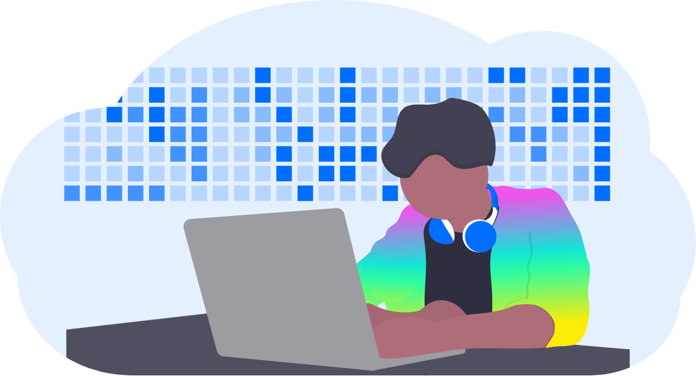

The [Space Daemon](https://github.com/FleekHQ/space-daemon) packages together [IPFS](https://ipfs.io/), [Textile](https://textile.io/) Threads/Buckets, and Textile Powergate (Filecoin) into one easy to install and JS interface to make it easy to build peer to peer and  privacy focused apps.

Installing the [Space Daemon](https://github.com/FleekHQ/space-daemon) is easy and comes with all the tools packaged together including IPFS and Textile nodes, and and also exposes gRPC methods specific to the features you want for your app including: File Upload (encrypted), File Sharing, Filecoin Markets, and User Controlled Data. You can access same methods using our [JS client](https://github.com/FleekHQ/space-client), so you don't need to worry about gRCP calls.

!!! warning

    Space Daemon is currently in Alpha as we continue to deliver new features at a rapid pace which could mean making changes to existing APIs and/or loss of data. The Daemon will remain in this state until we are closer to releasing our own production application we’re building on top of the Space Daemon.

Space is the next evolution of Cloud, where users can interact with apps fully private, p2p, and control their own data. Big tech has taken advantage of user data for far too long, time to take back control of your privacy and ownership of your data. Here’s the features the Space Daemon will bring to your application:

- Fully Private file upload via encrypted textile buckets.
- Peer to Peer file sharing selectively with other people and/or within teams.
- Identity solution to enable users to be anywhere from fully anonymous to having as many identity associations as they want.
- Filecoin network interaction for file storage and retrieval markets.
- Super easy to use Js library with easy to understand functions for File CRUD, Sharing, Identity, Backups, etc.
- Datastore for applications and application registry to enable user data controlled applications.
- Trustless Data backups.
- Local file system mounting.
- More...

!!! info

    The Space Daemon is a service that runs on users desktops. It is ideal for building desktop apps that need file encryption and sharing on top of it. Space Daemon can be bundled and distributed with desktop apps and eventually mobile apps too. It can not be “embedded” in a JavaScript web application though.

    If you are building a web application that needs decentralized file or data storage where the user owns their data, it’s probably better to use Textile’s Threads DB or Buckets directly since they have independent JavaScript interfaces. If you want to build an app that connects to Space Daemon after users already installed it (think of as a wallet), it is a good idea to use Space Client for the connection from your web app to your users Daemon.

  <a href="../getting-started/#installation" class="prev-box">
    <h5>Daemon Installation</h5>
    
Install the Space Daemon

  </a>
  <a href="../getting-started/#crud-operations" class="prev-box">
    <h5>Private File Operations</h5>
    
Interact with File Commands

  </a>
  <a href="../getting-started/#p2p-sharing/" class="prev-box">
    <h5>P2P Sharing</h5>
    
Integrate Sharing Files Peer to Peer

  </a>
  <a href="../getting-started/#identity/" class="prev-box">
    <h5>Identity Service</h5>
    
From Fully Anonymous, to Teams, to Public Associations

  </a>

