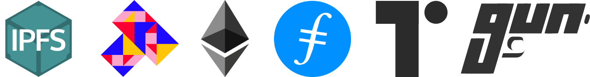

The [Space SDK](https://github.com/FleekHQ/space-sdk) is a Javascript/Typescript modular library and set of interfaces that packages tools and features enabled by Open Web protocols like [IPFS](https://ipfs.io/), [Textile](https://textile.io/), [Filecoin](https://filecoin.io/), [GunDB](https://gun.eco/), and [Ethereum](https://ethereum.org/) in easy to use commands, **via the Space API**, for anyone to use when building applications or websites powered by the Distributed Open Web.



### **Technical Documentation**
> This is a general overview of the SDK, its purpose, and features. For in depth usage guidance, read the Space SDK's [complete documentation](https://fleekhq.github.io/space-sdk/docs/) page.

**You can find the repository and documentation here:**

* [Space SDK Github Page](https://github.com/FleekHQ/space-sdk)
* [Space SDK Documentation](https://fleekhq.github.io/space-sdk/docs/)
* [Entire Space SDK package breakdown](https://fleekhq.github.io/space-sdk/docs/sdk)

## Introduction
The Space SDK is a set of modular interfaces that include all necessary tools to build the base feature/architecture layer of applications and websites, but powered with Open Web protocols that give that layer trustless, decentralized, or user-controlled characteristics:

- User-controlled identity management / authentication.
- Encrypted and user-owned storage.
- Private and end-to-end encrypted file sharing.
- Decentralized / trustless key & metadata storage and handling.

The Space SDK packages these features in a set of APIs and interfaces that you as a user can use as is, with the current protocol implementations, or personalize to add -for example- your own custom storage layer instead of using Textile/IPFS. In Space, for example, we plug [Torus](https://tor.us/) as a seamless key management layer.

## Currently Available APIs
The Space SDK currently includes the following API:

|API/Module   	|Description  	| Default Implementation
|-:	|-	|-	|
| Users 	|  Key-pair based identity creation, and challenge authentication.	| Textile Users API
| Storage 	|  File, directory, and bucket creation/listing.	| IPFS / Textile / GunDB
| Sharing 	|  Sharing specific files 	| Textile

## The Space SDK versus the Space Daemon
The Space SDK is the next evolution of our other open source library, the [Space Daemon](https://github.com/FleekHQ/space-daemon/), which is a desktop-focused Go library. They both have different purposes, but enable similar functionalities.

**The main difference** between the Space SDK and the Space Daemon is that the SDK is built as a JavaScript/Typescript modular library, and the Space Daemon is a wrapper built in Go and provides gRPC methods.

That makes the Space Daemon ideal for desktop-focused applications. It runs local instances of Textile and IPFS nodes, and can leverage local storage. But, it is not exactly highly compatible with browser or mobile experiences, where JavaScript is preferable and running local Textile / IPFS instances is not yet possible across all platforms (some browsers like Brave have started adding IPFS support but it is early still).

Furthermore, the Space Daemon's nodes **can interact with web applications**, but can't be embedded on in a JS web application.

The Space SDK, on the other hand, as a JS library, opens up the door for taking all the features of the Space Daemon to **browser and mobile experiences**, and without the need of having to run local instances of those protocols. It's light, 

### Which one should you use?
Both libraries are in active development. We created both of them because, **as part of our mission**, we want to make it as easy to build on the Web3 and its underlying protocols as it is today on Web2. **No matter the platform you're choosing to build on**.

From our point of perspective, the Space SDK might overtake the Space Daemon in the sense that we see it is capable of offering the same set of desktop-enabled and local features the Daemon does, without losing browser/mobile compatibility. 

## Installing the Space SDK
Installing the Space SDK is fast and simple, just use the following npm command to install this library:
```
npm install @spacehq/sdk
```
That's it! Think of this SDK as a **complement to your website or application** . You can create any website (on Jamstack, for example) or app, and plug-in the Space SDK as the underlying layer that powers its features.

## Using the SDK
For an in-depth guide of the methods / commands visit the Space SDK's [technical documentation](https://fleekhq.github.io/space-sdk/docs/).

### What features does Space and the SDK enable?


- Fully private file upload via encrypted textile buckets.
- Online and user-controlled storage setups on IPFS/Textile.
- End-to-end encrypted and private file sharing with Thread/Bucket permission.
- Identity solution and authentication, key-pair based and user-owned.
- Trustless and decentralized key and metadata storage on GunDB.
- Easy to use commands for sharing, identity, backups, etc.
- More...

## Migrating from the Space Daemon
Are you already working with the Space Daemon and want to migrate your application or website to the Space SDK? Most of the methods involved have direct and familiar counterparts on the Space SDK. You can find a detailed explanation for the following features in the [SDK's technical documentation](https://fleekhq.github.io/space-sdk/docs/#migrating-from-space-daemon):

- Generating Key Pairs
- Managing Authenticated Users
- GetAPISessionToken
- GetPublicKey
- Storage Methods