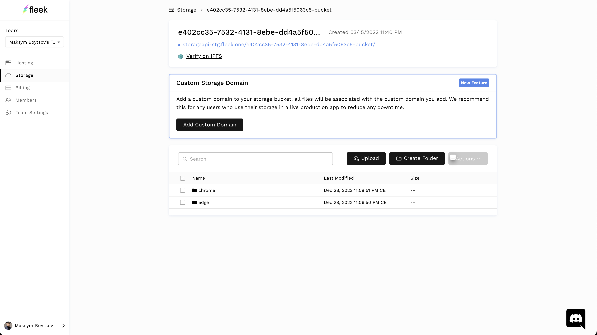
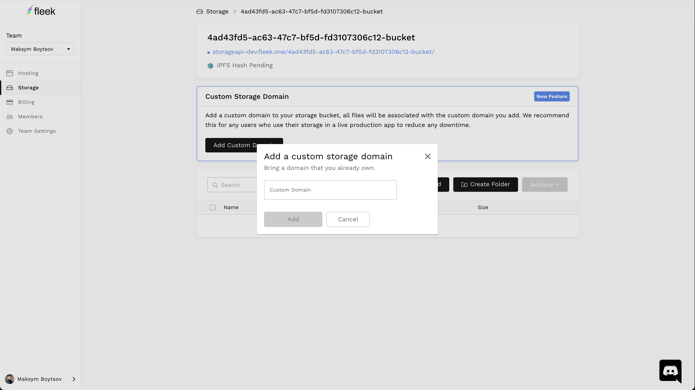
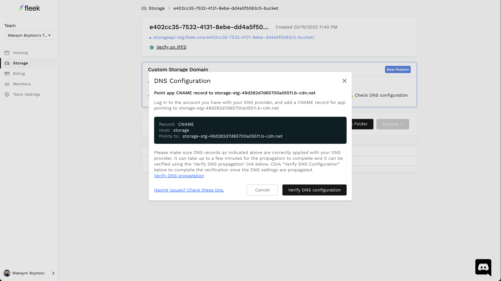
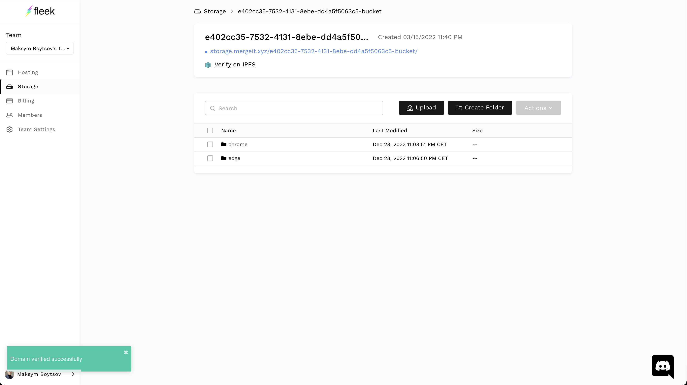

---
date: "1"
image: "https://terminalco.wpcomstaging.com/wp-content/uploads/2020/03/FleekMeta.jpg"
---

# Custom Storage API Domains

Upon creation of a Fleek.co Storage bucket, users are assigned a default API URL that looks something like: 'Storageapi.fleek.one` + bucket ID.

With Custom Storage API Domains, we're increasing the uptime, availability, and accessibility of these storage buckets by allowing existing Fleek.co storage users to add their own custom domains to map to their Fleek storage buckets.

!!! info

    When you deploy on Fleek your site will have an IPFS hash and future automatic deployments will also update the IPFS hash of your site. Your site comes with a CDN, free SSL certificate, and a Fleek preview URL. You can add Custom Domains, ENS Domains, Configure Deploy Previews, and more.

## Add Custom Domain

Navigate to the storage tab, denoted by a `new` prompt and found in the vertical navigation bar of the Fleek.co app.


#### 1.  Click `Add a Custom Domain`



#### 2.  Enter the Domain you want to map to your storage bucket -- make sure this is a domain you own.



#### 3.  After a bit of thinking, Fleek will recognize the domain you’re attempting to map. To let your custom domain know the location of your storage bucket click `⚠ Check DNS Configuration` for the relevant domain information. The "Points to" field what you need to set your DNS CNAME record to. 



## Verifying the Custom Domain

Through your domain provider, update the CNAME record to match the `Host` and `Value` records that the `DNS Configuration` modal provided. If you use a root domain, you will need to use a DNS provider that supports ANAME/ALIAS records.

Click `Verify DNS Configuration` in the `DNS Configuration` modal to verify changes.

If done properly Fleek will now be able to verify your domain, and your storage domain will change from the default `storageapi.fleek.one` URL to your custom domain + bucket ID. In the example below, we've successfully added `storage.mergeit.xyz` as the custom domain for a user with a bucket ID `e402cc35-7532-4131-...`.

This Fleek Storage bucket can then be accessed from `storage.mergeit.xyz/e402cc35-7532-4131-8ebe-dd4a5f506c5-bucket`.




## Consuming Your New Endpoint Via the Fleek.co SDK

If you use the Fleek SDK to consume your storage bucket, please make sure you upgrade the `@fleekhq/fleek-storage-js` package to `version 1.0.23 or higher`. This will allow you to input your custom storage domain as the endpoint.

After updating the Fleek SDK to `version 1.0.23 or anyone higher`, you can now do the following to use the custom domain added in the Fleek app:

```js

const buckets = await fleekStorage.listBuckets({
  apiKey: 'your key',
  apiSecret: 'your secret',
  domain: 'your custom domain'
});

```

Whether you use the Fleek SDK or just the domain URL, remember to update all references and application code to use your new custom domain.

