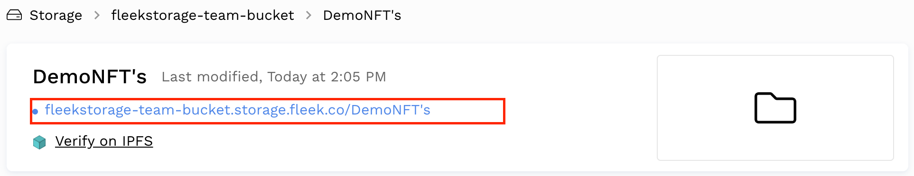

Upload, browse, and manage all your files through the app interface. All files uploaded are published to IPFS and published to DNS, with a CDN and File Compression. You can view and reference the files through the Fleek Storage URL, and can view directly on the IPFS gateway.

The Fleek Storage app is a tool meant to host public web assets.

!!! info

    As of 2023, we have begun the a gradual deprecation of Fleek.co's storage API endpoints in favor of custom, per-user, domains. Read more about how to prepare for this transition, and the road to a new storage service [in this blog](https://blog.fleek.co/posts/fleek-co-gateway-storage-url-deprecation)

## Upload Folders and Files

Go to the Storage page by selecting storage on the left-hand side navigation.

Click on the upload button to open the upload pop up. 

You can browse folders and files directly from your Finder, or drag and drop folders and files into the pop up.

Browse through your folders by clicking on the folder. Once you're in a folder the bucket URL will adjust to the route pointing to that folder, and this works the same for opening specific files.

## View the Bucket, Folders, or Files

You can view your bucket, folders, or files via the Fleek Storage URL or directly on the IPFS gateway

Viewing the folder or file on the Fleek Storage URL will boast the benefits of the built in CDN, file compression, and image resizing. Clicking on the Bucket or folder URL can also navigate further into the bucket or folders.

Bucket URL 

Folder URL

File URL

Viewing on the IPFS gateway will show the immutable IPFS file of the content within the URL.

 

## View File Details

When you open an individual file you can see details about that particual file including the Image Preview, Object URL, Name, Size, and the IPFS Hash.

## Other Actions

You can download and delete files. If you want to delete files in bulk you can select multiple, then select delete from the Actions menu.
